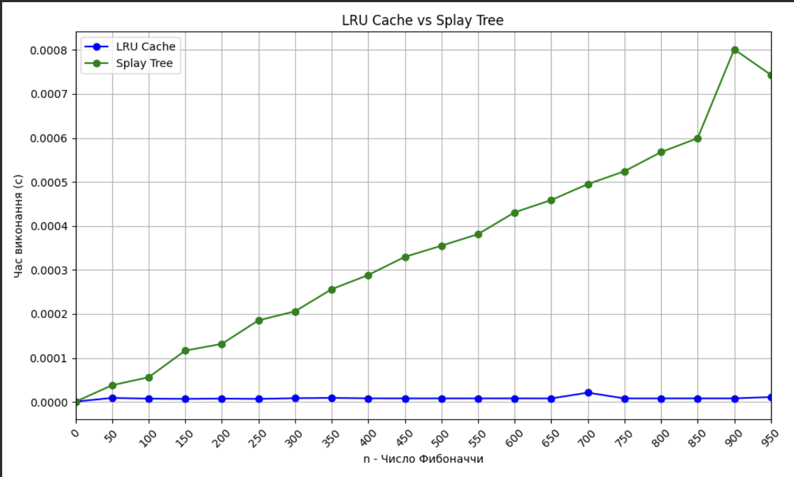

# goit-algo2-hw-07

Design and Analysis of Algorithms

Master of degree from University

### Завдання 1
Результати виконання програми:
```
Час виконання без кешування: 2.5491960048675537 секунд
Час виконання з LRU-кешем: 2.4480132007598877 секунд
```

### Завдання 2
Результати виконання програми:
```
n	LRU Cache (s)	Splay Tree (s)
0	0.000001		0.000000
50	0.000009		0.000038
100	0.000007		0.000056
150	0.000007		0.000117
200	0.000008		0.000132
250	0.000007		0.000185
300	0.000008		0.000206
350	0.000009		0.000256
400	0.000008		0.000288
450	0.000008		0.000330
500	0.000008		0.000355
550	0.000008		0.000381
600	0.000008		0.000431
650	0.000008		0.000459
700	0.000021		0.000495
750	0.000008		0.000524
800	0.000008		0.000568
850	0.000008		0.000599
900	0.000008		0.000801
950	0.000011		0.000743
```

### Графік

